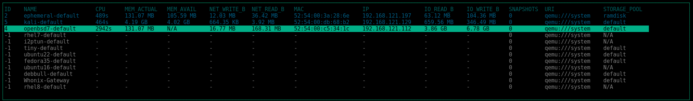

# virttop
a top like utility for libvirt



## How to get
```sh
pip install virttop
```

## Options
```sh
usage: virttop.py [-h] [--uri URI [URI ...]] [--config CONFIG]
                  [--active ACTIVE] [--logfile LOGFILE]

options:
  -h, --help            show this help message and exit
  --uri URI [URI ...], -u URI [URI ...]
                        A list of URIs to connect to seperated by commas
  --config CONFIG, -c CONFIG
                        Path to the config file
  --active ACTIVE, -a ACTIVE
                        Show active VMs only
  --logfile LOGFILE, -l LOGFILE
                        Location of the log file
```

## Configfile
The default location for the config file is '~/.virttop.toml'.

```toml
[color]
name_column_fg=23
name_column_bg=0
active_row_fg=24
active_row_bg=0
inactive_row_fg=244
inactive_row_bg=0
box_fg=29
box_bg=0
selected_fg=0
selected_bg=36
```

## Keybindings

`j`,`k` and arrow keys move up and down.

`g` moves to the top of the list.

`G` moves to the bottom of the list.

`r` runs an inactive domain.

`s` shuts down a running domain.

`d` destroys a running domain.
